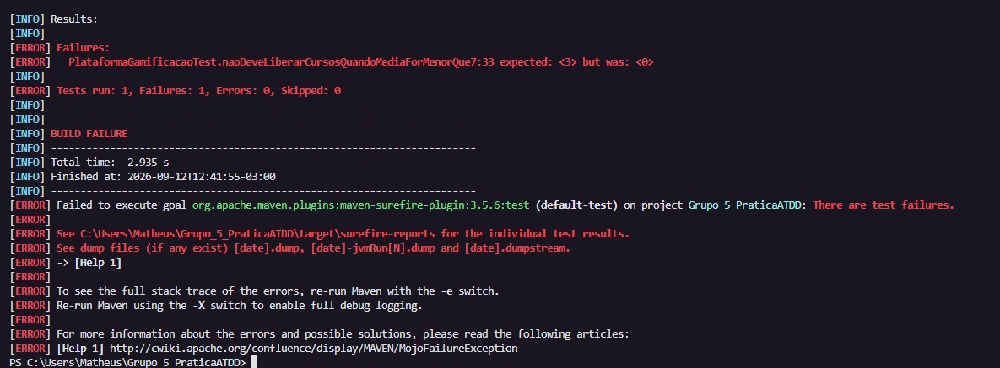
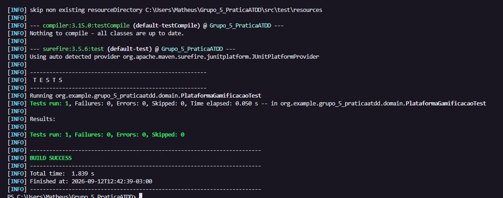
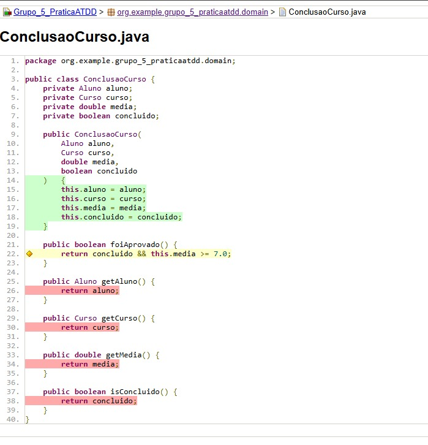
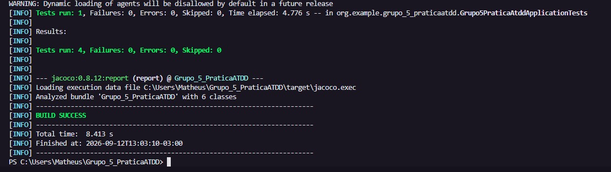
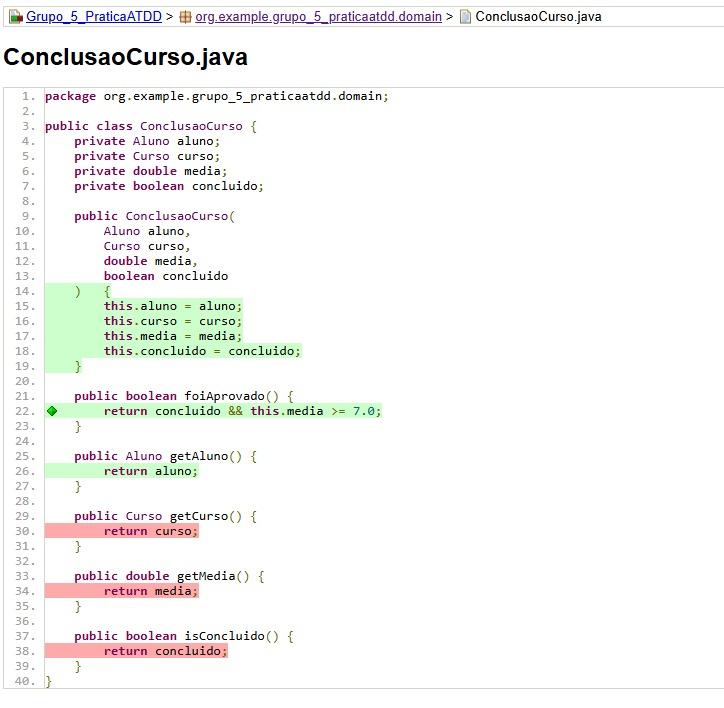

## Testes - Matheus Marcolino

### Cenário principal

Dado que o aluno concluiu um curso com média final de 6,5  
Quando o sistema processa a conclusão do curso  
Então o aluno não deve receber acesso a cursos adicionais.

O teste principal foi:

```java
@Test
public void naoDeveLiberarCursosQuandoMediaForMenorQue7() {

    var plataforma = new PlataformaGamificacao();

    var aluno = new Aluno("Matheus Marcolino", Plano.Basico);

    var curso = new Curso("Curso 1");

    var conclusao = new ConclusaoCurso(aluno, curso, 6.5, true);

    plataforma.processarConclusao(conclusao);

    assertEquals(0, aluno.getCursoAdicionaisLiberados());
}
```

### 🔴 RED

Na etapa RED, a expectativa foi colocada temporariamente como 3 cursos adicionais:

```java
assertEquals(3, aluno.getCursoAdicionaisLiberados());
```

O teste falhou com:

```text
expected: <3> but was: <0>
BUILD FAILURE
```



### 🟢 GREEN

A expectativa foi corrigida para 0:

```java
assertEquals(0, aluno.getCursoAdicionaisLiberados());
```

O teste passou com:

```text
Tests run: 1, Failures: 0, Errors: 0
BUILD SUCCESS
```



### 📊 JaCoCo após o GREEN

Foi executado somente o teste principal, e o relatório do JaCoCo mostrou cobertura parcial na condição:

```java
return concluido && this.media >= 7.0;
```

A linha ficou amarela, indicando que nem todos os caminhos da condição estavam cobertos.



### 🔵 BLUE

Com base no JaCoCo, foi criado um teste complementar para cobrir o cenário em que o aluno possui média suficiente, porém o curso não foi concluído:

```java
@Test
public void naoDeveLiberarCursosQuandoCursoNaoFoiConcluido() {

    var plataforma = new PlataformaGamificacao();

    var aluno = new Aluno("Matheus Marcolino", Plano.Basico);

    var curso = new Curso("Curso 1");

    var conclusao = new ConclusaoCurso(aluno, curso, 7.0, false);

    plataforma.processarConclusao(conclusao);

    assertEquals(0, aluno.getCursoAdicionaisLiberados());
}
```

Os testes continuaram passando e o novo cenário cobriu o caminho que estava faltando na condição `concluido && this.media >= 7.0`.



### 📊 JaCoCo final

Após o BLUE, o método `foiAprovado()` passou a apresentar **100% de cobertura de instruções e 100% de cobertura de branches**, deixando a condição totalmente coberta.



### Commits

Commits feitos na branch `Matheus`:

```text
GREEN: 9c007f7
BLUE: b5e1814
```

O primeiro commit registra o estado GREEN e o segundo registra o BLUE com aumento de cobertura.

### Resultado

O fluxo realizado foi:

**RED → GREEN → JaCoCo → BLUE → JaCoCo final**
