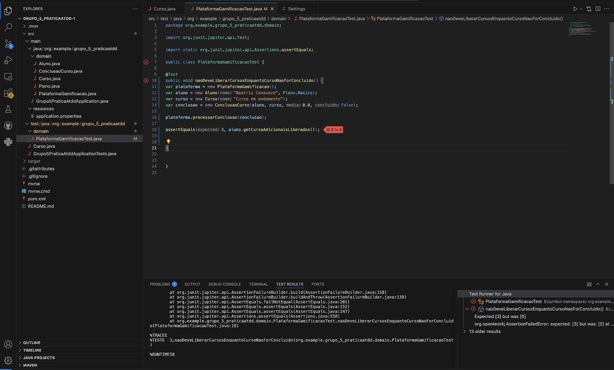
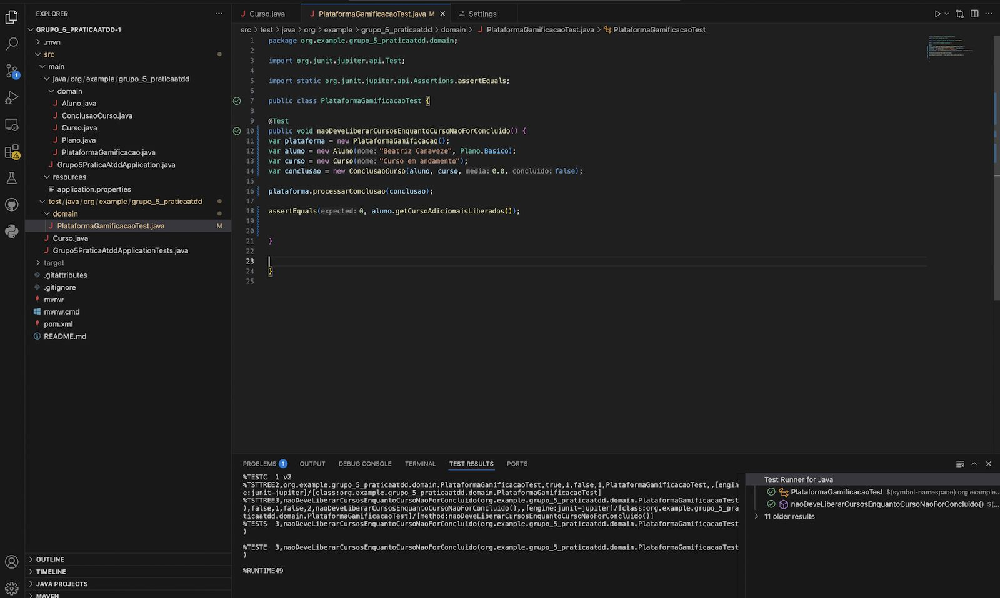
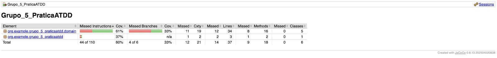
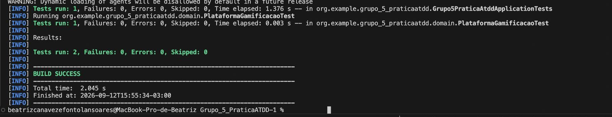

# Beatriz Canaveze - ATDD

## BDD

### Cenário: Não liberar novos cursos enquanto o curso não for concluído

**DADO QUE** o aluno está cursando um curso e ainda não o concluiu  
**QUANDO** o sistema verifica a liberação de novos cursos  
**ENTÃO** nenhum curso adicional deve ser liberado.

---

## TDD

### RED

Foi criado o teste:

`naoDeveLiberarCursosEnquantoCursoNaoForConcluido()`

O teste foi desenvolvido para validar o comportamento definido no cenário BDD, em que um aluno que ainda não concluiu o curso não deve receber cursos adicionais.

Na primeira execução, o teste utilizava o seguinte valor esperado:

```java
assertEquals(3, aluno.getCursoAdicionaisLiberados());

Porém, o sistema retornou 0, fazendo com que o teste falhasse.

Resultado obtido:

AssertionFailedError: expected: <3> but was: <0>

Esse resultado demonstrou que o comportamento observado não correspondia ao valor esperado inicialmente definido no teste.

Evidência RED



GREEN

Para adequar o teste ao comportamento definido pelo cenário BDD, o valor esperado foi alterado de 3 para 0.

O teste passou a utilizar:

assertEquals(0, aluno.getCursoAdicionaisLiberados());

Dessa forma, o teste passou a verificar que nenhum curso adicional é liberado enquanto o curso ainda não foi concluído.

Após a alteração, os testes foram executados novamente e todos passaram com sucesso:

Tests run: 2, Failures: 0, Errors: 0, Skipped: 0
BUILD SUCCESS
Evidência GREEN



Cobertura de Testes - JaCoCo

Após a etapa GREEN, foi executado o JaCoCo para analisar a cobertura dos testes.

No pacote domain, foi obtida cobertura de 61% das instruções e 33% dos branches.

Considerando o projeto como um todo, a cobertura foi de 60% das instruções e 33% dos branches.

Foram analisadas 6 classes no projeto.

Os resultados indicam que parte das instruções e dos caminhos condicionais ainda não é exercitada pelos testes existentes.

Evidência JaCoCo



BLUE - Refatoração

Não foram realizadas refatorações após a etapa GREEN.

O código permaneceu sem alterações de refatoração, mantendo a implementação responsável pelo comportamento validado no teste.

Após essa etapa, os testes foram executados novamente e permaneceram passando com sucesso:

Tests run: 2, Failures: 0, Errors: 0, Skipped: 0
BUILD SUCCESS
Evidência BLUE



Commits

Os commits relacionados à implementação deste cenário devem ser identificados a partir do histórico do Git do projeto.
