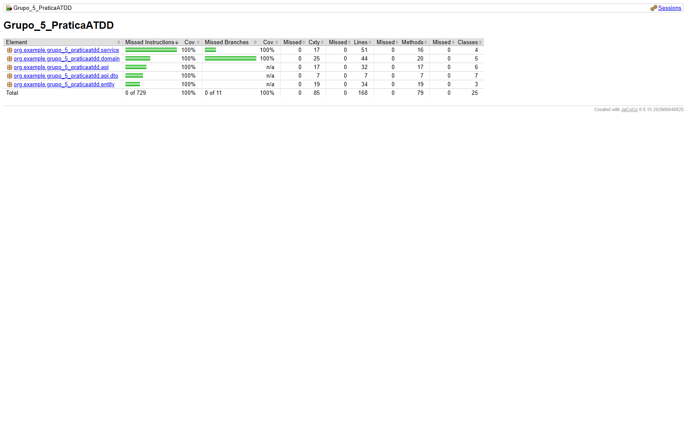

# Evidência — cobertura JaCoCo atual

Verificação em 14/09/2026:

```sh
./mvnw clean verify
```

```text
Tests run: 20, Failures: 0, Errors: 0, Skipped: 0
All coverage checks have been met.
BUILD SUCCESS
```

O relatório `target/site/jacoco/index.html` e o CSV `target/site/jacoco/jacoco.csv` apresentaram, nas **25 classes analisadas**:



| Métrica | Coberto | Perdido | Cobertura |
| --- | ---: | ---: | ---: |
| Instruções | 729 | 0 | 100% |
| Branches | 11 | 0 | 100% |
| Linhas | 168 | 0 | 100% |

A classe `Grupo5PraticaAtddApplication` foi excluída do relatório por conter somente o método `main` que inicializa o Spring Boot, sem regra de negócio. As demais classes permanecem incluídas. O plugin JaCoCo executa `check` na fase `verify` e falha o build se alguma instrução, branch ou linha dessas classes ficar sem cobertura.

A imagem acima foi capturada do relatório gerado pelo Maven em 13/09/2026. Após o cenário do Rafael, a execução textual de 14/09/2026 passou com 20 testes e manteve as mesmas métricas de cobertura, pois nenhuma classe de produção foi alterada. Para reproduzir o relatório atualizado, execute o comando acima e abra `target/site/jacoco/index.html` no navegador. O diretório `target/` é ignorado pelo Git; esta página preserva o resultado e o comando de reprodução.
