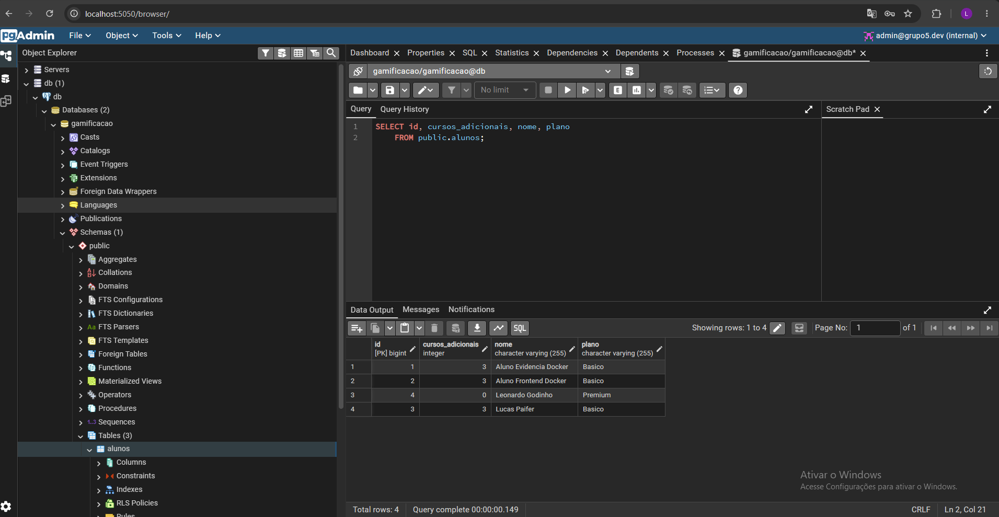
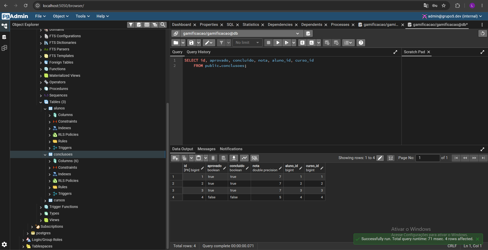
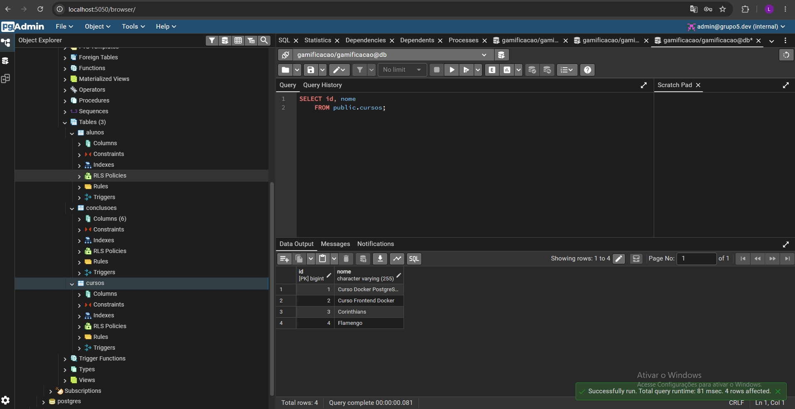
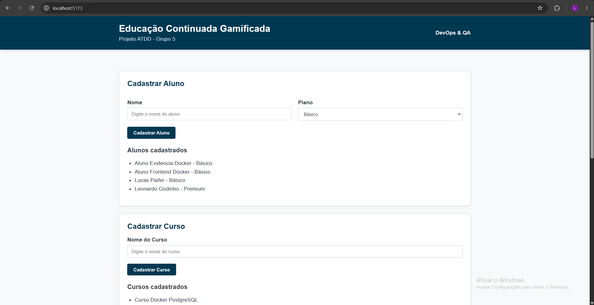
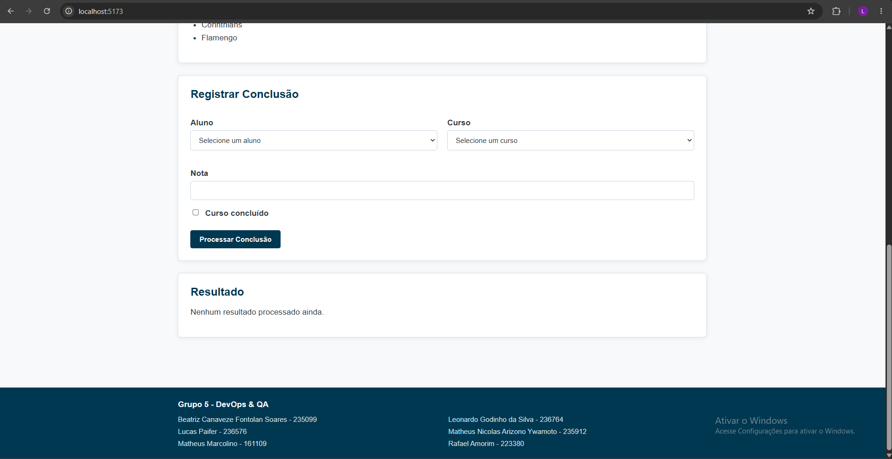

# Evidência — aplicação e PostgreSQL no Docker

Verificação realizada em 13/09/2026 com Docker Desktop 27.1.1, Docker Compose v2.29.1 e PostgreSQL 17.11.

Após `docker compose up --build -d`, `docker compose ps` mostrou os quatro serviços ativos: frontend em `127.0.0.1:5173`, API saudável em `127.0.0.1:8080`, banco saudável em `127.0.0.1:55434` e pgAdmin em `127.0.0.1:5050`. A página de login do pgAdmin respondeu HTTP 200; de dentro do contêiner, o nome `db` foi resolvido na rede Docker. O log da API confirmou `jdbc:postgresql://db:5432/gamificacao`, driver PostgreSQL e versão 17.11.

Pela API, foram cadastrados o curso `Curso Docker PostgreSQL` (ID 1) e o aluno `Aluno Evidencia Docker` (ID 1). Uma conclusão com nota `7.0` e `concluido=true` retornou:

```json
{"alunoId":1,"aluno":"Aluno Evidencia Docker","curso":"Curso Docker PostgreSQL","nota":7.0,"concluido":true,"aprovado":true,"cursosAdicionais":3}
```

A consulta `GET /api/alunos/1` retornou `cursosAdicionais: 3` e um item de histórico aprovado. No PostgreSQL, a consulta direta confirmou os mesmos dados:

```sh
docker compose exec -T db psql -U gamificacao -d gamificacao -c "SELECT a.id, a.nome, a.cursos_adicionais, c.nome AS curso, x.nota, x.concluido, x.aprovado FROM alunos a JOIN conclusoes x ON x.aluno_id = a.id JOIN cursos c ON c.id = x.curso_id WHERE a.id = 1;"
```

```text
 id |          nome          | cursos_adicionais |          curso          | nota | concluido | aprovado
----+------------------------+-------------------+-------------------------+------+-----------+----------
  1 | Aluno Evidencia Docker |                 3 | Curso Docker PostgreSQL |    7 | t         | t
(1 row)
```

Depois de `docker compose restart db api`, `GET /api/alunos/1` ainda retornou o aluno com três cursos adicionais e o histórico, confirmando a persistência entre reinícios dos contêineres.

## Inspeção pelo pgAdmin

Nas capturas do pgAdmin fornecidas pelo grupo, o servidor `db` está conectado ao banco `gamificacao` e o esquema `public` mostra as tabelas `alunos`, `conclusoes` e `cursos`. As consultas executadas no Query Tool foram:

```sql
SELECT id, cursos_adicionais, nome, plano FROM public.alunos;
SELECT id, aprovado, concluido, nota, aluno_id, curso_id FROM public.conclusoes;
SELECT id, nome FROM public.cursos;
```

A captura de `alunos` mostra quatro registros. Entre eles, `Lucas Paifer` (plano `Basico`) tem `cursos_adicionais = 3`.



A captura de `conclusoes` mostra quatro registros: três aprovados e concluídos com nota `7`, e um não aprovado/não concluído com nota `5`.



A captura de `cursos` mostra quatro registros. Essas três imagens registram a persistência e a consulta das tabelas pelo pgAdmin.



Com o frontend incluído no Compose, `GET /` e `GET /about` pelo endereço `http://127.0.0.1:5173` responderam HTTP 200. Pelo mesmo endereço, as chamadas `POST /api/cursos`, `POST /api/alunos`, `POST /api/conclusoes` e `GET /api/alunos/2` passaram pelo proxy Nginx e retornaram o fluxo completo. A conclusão do aluno `Aluno Frontend Docker` com nota `7.0` retornou três cursos adicionais e um item no histórico. A consulta direta no PostgreSQL confirmou o registro:

```text
 id |         nome          | cursos_adicionais |         curso         | nota | aprovado
----+-----------------------+-------------------+-----------------------+------+----------
  2 | Aluno Frontend Docker |                 3 | Curso Frontend Docker |    7 | t
(1 row)
```

As capturas da interface Vue na porta `5173` mostram os formulários de cadastro, os alunos e cursos carregados e o formulário de conclusão. O resultado de processamento não está visível nessas imagens; a execução do fluxo é registrada pelas respostas da API e pela consulta ao PostgreSQL descritas nesta página.




