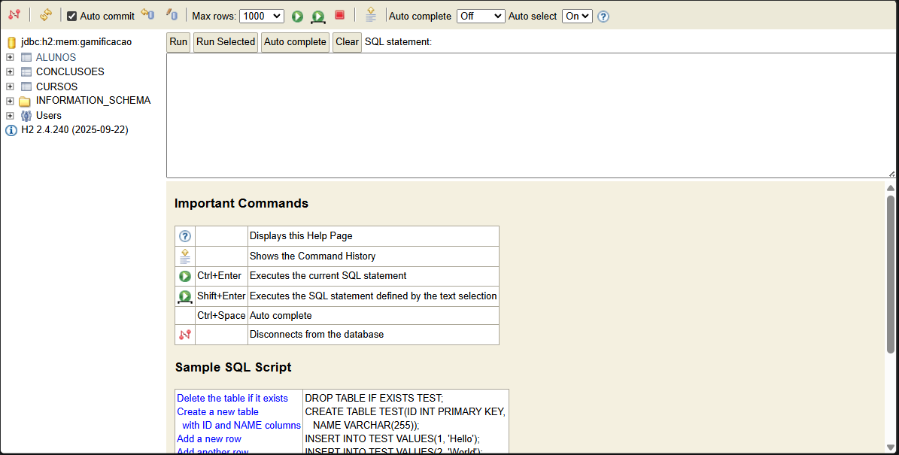
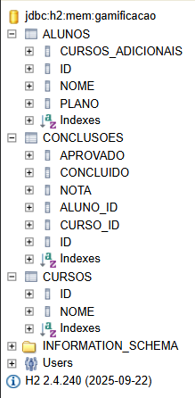

# Evidência — banco H2 em execução

Verificação realizada em 13/09/2026 com Java 26 e o perfil `h2` da aplicação.

O teste de integração `H2PersistenceTest` identificou o banco pelo JDBC como **H2**. Depois de cadastrar um curso e um aluno pela API e processar uma conclusão com nota `7.0`, ele consultou diretamente as tabelas:

```sql
SELECT cursos_adicionais FROM alunos WHERE id = ?;
SELECT aprovado FROM conclusoes WHERE aluno_id = ? AND curso_id = ?;
```

Os valores lidos foram `3` e `true`. Na verificação mais recente, `.\mvnw.cmd clean verify` terminou com **19 testes aprovados**, sem falhas ou erros.

Também foi iniciada uma instância local do JAR com o comando abaixo. O console em `http://127.0.0.1:8082/h2-console/` respondeu HTTP **200**.

```powershell
java -jar target/Grupo_5_PraticaATDD-0.0.1-SNAPSHOT.jar --spring.profiles.active=h2 --server.port=8082
```

Na execução atual, foram cadastrados o aluno `Aluno H2 Evidencia` e o curso `Curso H2 Evidencia`, ambos com ID `1`. O processamento da conclusão com nota `7.0` retornou aprovação, três cursos adicionais e um item no histórico do aluno.

```json
{"alunoId":1,"aluno":"Aluno H2 Evidencia","curso":"Curso H2 Evidencia","nota":7.0,"concluido":true,"aprovado":true,"cursosAdicionais":3}
```

## Capturas do console H2

A primeira imagem mostra o console conectado a `jdbc:h2:mem:gamificacao`, com as tabelas `ALUNOS`, `CONCLUSOES` e `CURSOS` no painel lateral.



A segunda imagem mostra as colunas das três tabelas expandidas. Essas capturas comprovam a conexão e a criação do esquema; os dados do aluno e da conclusão foram verificados separadamente pela API e pelo teste de integração descritos acima.



Para consultar os registros manualmente, mantenha a aplicação aberta e acesse <http://127.0.0.1:8082/h2-console/>. Use URL JDBC `jdbc:h2:mem:gamificacao`, usuário `sa` e senha vazia. Depois de conectar, execute no editor SQL:

```sql
SELECT id, nome, plano, cursos_adicionais FROM alunos;
SELECT id, nota, concluido, aprovado, aluno_id, curso_id FROM conclusoes;
SELECT id, nome FROM cursos;
```

Como o banco é em memória, os registros são apagados ao encerrar a aplicação; em uma nova execução, será preciso cadastrá-los novamente pela API.
