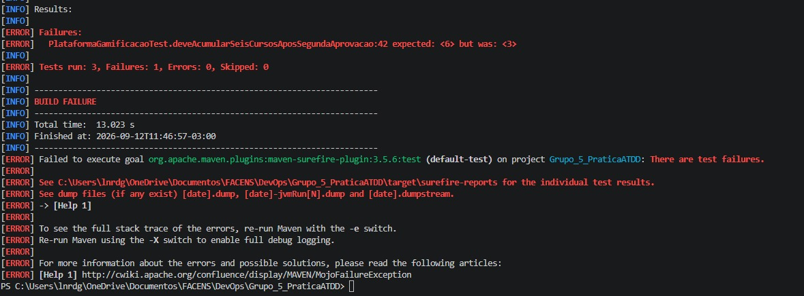
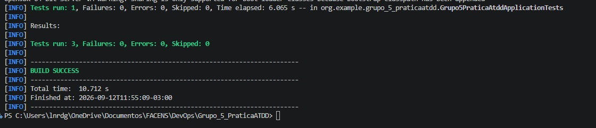
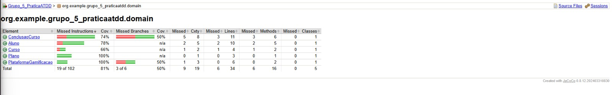
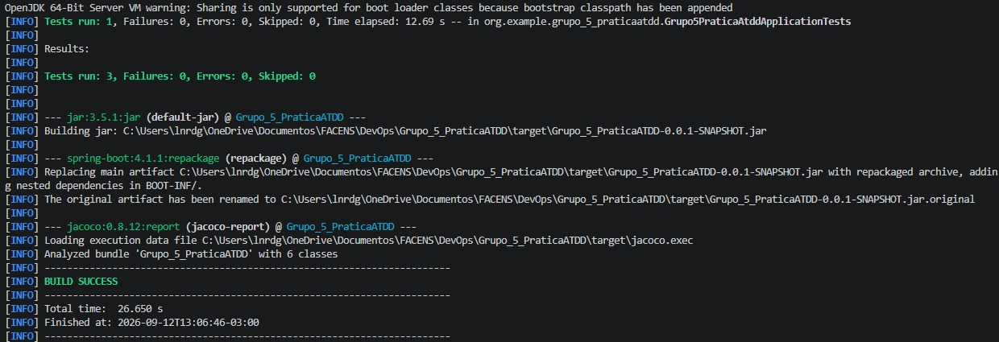

# Leonardo Godinho da Silva - ATDD

## BDD

### Cenário: Acúmulo de cursos adicionais após segunda aprovação

**DADO QUE** o aluno do plano Básico já concluiu um curso com média maior ou igual a 7,0 e recebeu 3 cursos adicionais  
**E** concluiu um segundo curso também com média maior ou igual a 7,0  
**QUANDO** o sistema processar a conclusão do segundo curso  
**ENTÃO** o aluno deve receber mais 3 cursos adicionais  
**E** deve totalizar 6 cursos adicionais liberados.

---

## TDD

### RED

Foi criado o teste:

`deveAcumularSeisCursosAposSegundaAprovacao()`

No primeiro momento, a implementação não acumulava os cursos adicionais. Após duas aprovações, o teste esperava 6 cursos adicionais, porém o sistema retornava somente 3.

Resultado obtido:

```text
expected: <6> but was: <3>
Tests run: 3, Failures: 1, Errors: 0
BUILD FAILURE
```

### Evidência RED



---

### GREEN

A implementação foi ajustada para acumular os cursos adicionais liberados ao aluno.

Alteração realizada:

```java
public void liberarCursos(int quantidade) {
    this.cursosAdicionaisLiberados += quantidade;
}
```

Após a alteração, os testes passaram com sucesso:

```text
Tests run: 3, Failures: 0, Errors: 0, Skipped: 0
BUILD SUCCESS
```

### Evidência GREEN



---

## Cobertura de Testes - JaCoCo

Após a etapa GREEN, foi executado o JaCoCo para análise da cobertura dos testes.

No pacote `domain`, foi obtida cobertura de **81% das instruções**.

A classe `PlataformaGamificacao` atingiu **100% de cobertura de instruções**.

Os cenários ainda não cobertos estão relacionados às demais regras de negócio e BDDs do projeto.

### Evidência JaCoCo



---

## BLUE - Refatoração

Na etapa BLUE foram realizadas refatorações sem alterar a regra de negócio da aplicação.

### Remoção de número mágico

Foi criada a constante:

```java
private static final double MEDIA_MINIMA_APROVACAO = 7.0;
```

A validação passou a utilizar:

```java
public boolean foiAprovado() {
    return concluido && media >= MEDIA_MINIMA_APROVACAO;
}
```

### Refatoração de nomenclatura

O getter:

```java
getCursoAdicionaisLiberados()
```

foi renomeado para:

```java
getCursosAdicionaisLiberados()
```

Após as refatorações, todos os testes continuaram passando:

```text
Tests run: 3, Failures: 0, Errors: 0, Skipped: 0
BUILD SUCCESS
```

### Evidência BLUE



---

## Commits

- `249f4f1` - GREEN - implementar acumulo de cursos adicionais
- `ef0a1be` - BLUE - refatorar nomenclatura e regra de aprovacao
- `6cd29cf` - BLUE - corrigir nomenclatura do getter de cursos adicionais