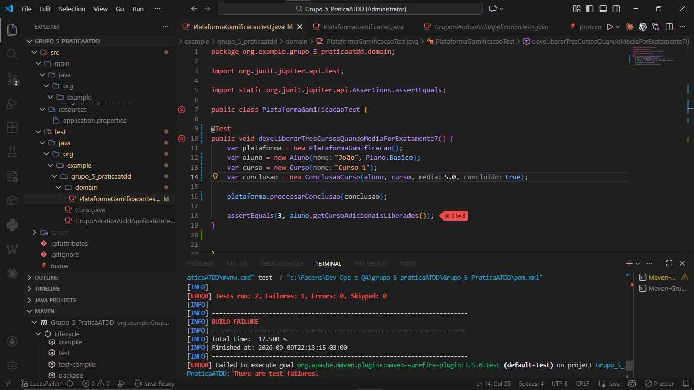
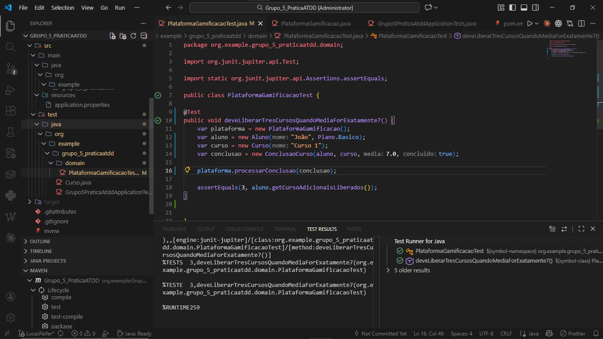
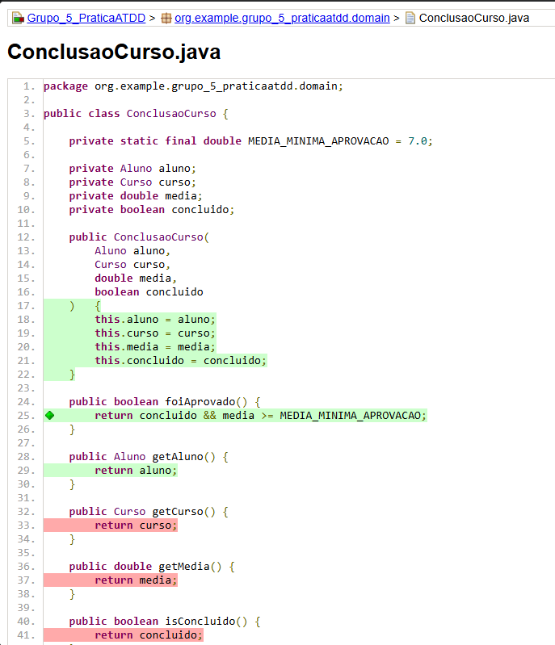

# Lucas Paifer - ATDD

## BDD

### Cenário: Liberação de cursos adicionais com média exatamente 7,0

**DADO QUE** o aluno concluiu um curso com média final igual a 7,0  
**QUANDO** o sistema processa a conclusão do curso  
**ENTÃO** o aluno deve ter acesso liberado a mais 3 cursos adicionais.

---

## TDD

### RED

O teste `deveLiberarTresCursosQuandoMediaForExatamente7()` foi executado temporariamente com média **5,0**, mantendo a expectativa de 3 cursos adicionais. Como 5,0 está abaixo da média mínima de aprovação, o sistema liberou 0 cursos e a asserção falhou:

```text
expected: <3> but was: <0>
Tests run: 2, Failures: 1, Errors: 0, Skipped: 0
BUILD FAILURE
```

Esse RED mostra que a asserção detecta uma nota que não atende ao cenário. Ele não representa uma falha da regra de aprovação para a média 7,0.

### Evidência RED



---

### GREEN

A média do teste foi ajustada para **7,0**, conforme o critério de aceitação. A regra de aprovação já implementada considera o curso concluído e a média maior ou igual a 7,0; por isso, o processamento libera 3 cursos adicionais. Não foi necessária alteração no código de produção nesta etapa.

Teste final:

```java
@Test
public void deveLiberarTresCursosQuandoMediaForExatamente7() {
    var plataforma = new PlataformaGamificacao();
    var aluno = new Aluno("João", Plano.Basico);
    var curso = new Curso("Curso 1");
    var conclusao = new ConclusaoCurso(aluno, curso, 7.0, true);

    plataforma.processarConclusao(conclusao);

    assertEquals(3, aluno.getCursosAdicionaisLiberados());
}
```

O painel **Test Results** mostra `deveLiberarTresCursosQuandoMediaForExatamente7()` aprovado.

### Evidência GREEN



---

## BLUE - Refatoração

O método `foiAprovado()`, antes sinalizado em amarelo (YELLOW), foi alterado na etapa de refatoração. A condição de aprovação ficou expressa com a média mínima definida em uma constante:

```java
private static final double MEDIA_MINIMA_APROVACAO = 7.0;

public boolean foiAprovado() {
    return concluido && media >= MEDIA_MINIMA_APROVACAO;
}
```

Após a alteração, o código avançou para BLUE e o teste `deveLiberarTresCursosQuandoMediaForExatamente7()` continuou passando. Assim, a refatoração manteve o comportamento esperado: um curso concluído com média exatamente 7,0 libera 3 cursos adicionais. BLUE identifica a etapa de refatoração com os testes aprovados.

Verificação atual do teste isolado:

```text
Tests run: 1, Failures: 0, Errors: 0, Skipped: 0
BUILD SUCCESS
```

### Evidência BLUE

O relatório JaCoCo abaixo mostra a linha de `foiAprovado()` coberta após a refatoração:


