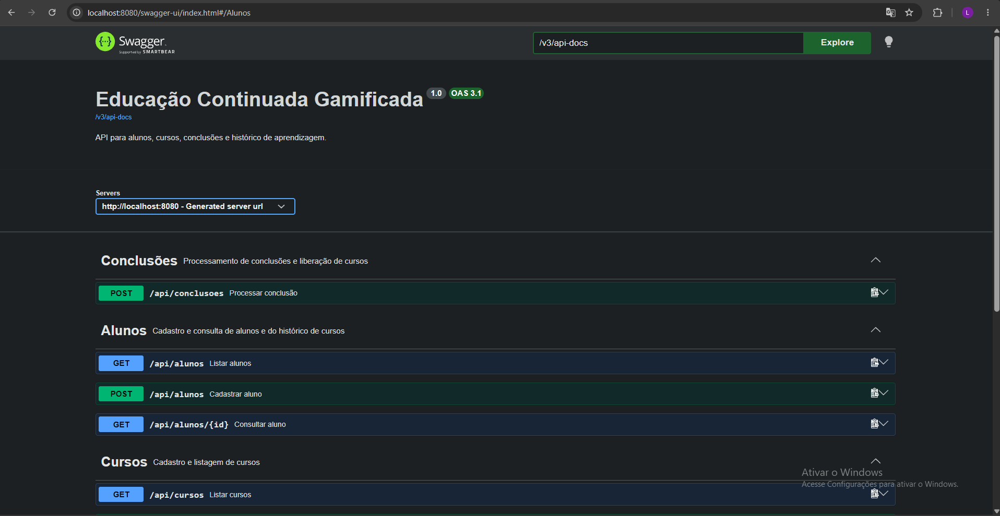
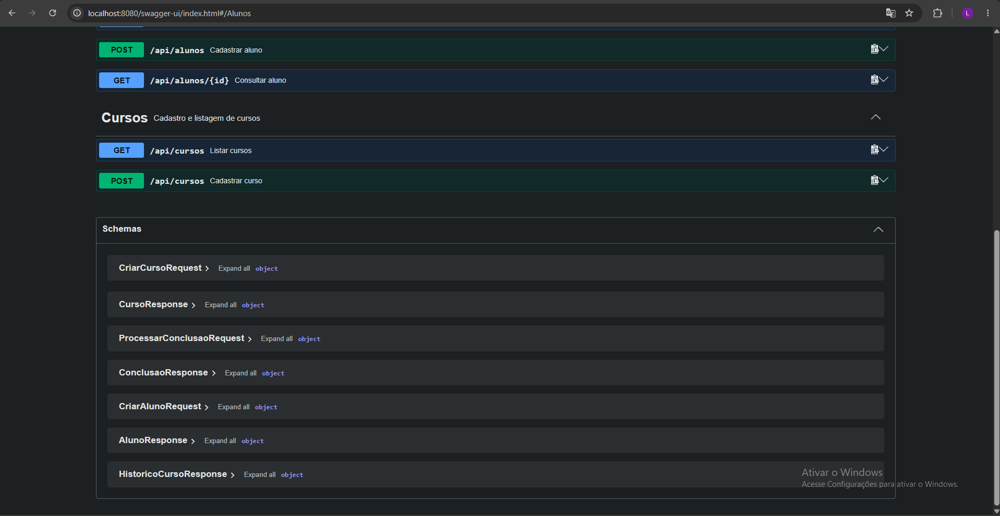

# Evidência da API no Swagger

Com a aplicação em execução, a interface Swagger UI fica em <http://localhost:8080/swagger-ui.html> e a especificação OpenAPI em JSON em <http://localhost:8080/v3/api-docs>.

A captura da interface mostra a API **Educação Continuada Gamificada**, com operações agrupadas em **Conclusões**, **Alunos** e **Cursos**. Estão visíveis o processamento de conclusões (`POST /api/conclusoes`), o cadastro e a consulta de alunos (`GET /api/alunos`, `POST /api/alunos`, `GET /api/alunos/{id}`) e a listagem de cursos (`GET /api/cursos`). A captura seguinte também mostra o cadastro de cursos (`POST /api/cursos`).

A seção **Schemas** exibe os modelos de entrada e saída usados pelos endpoints, incluindo `CriarAlunoRequest`, `AlunoResponse`, `HistoricoCursoResponse`, `CriarCursoRequest`, `CursoResponse`, `ProcessarConclusaoRequest` e `ConclusaoResponse`. Na captura, os modelos estão recolhidos; seus campos podem ser inspecionados ao expandi-los na interface.

O teste [`OpenApiTest.java`](../src/test/java/org/example/grupo_5_praticaatdd/api/OpenApiTest.java) verifica que `/v3/api-docs` publica as operações esperadas e que a URL do Swagger UI responde. O [contrato da API](API_CONTRACT.md) traz exemplos de requisições e respostas.
