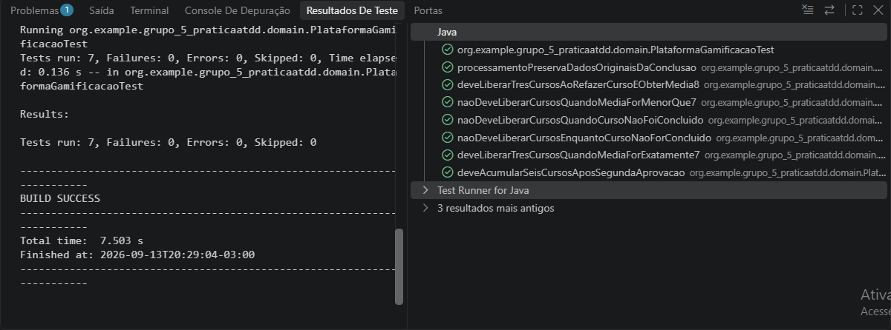
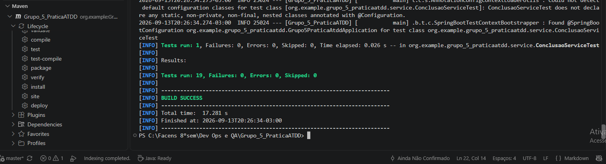

# Evidências de execução dos testes

## JUnit — testes de domínio

A captura da execução de `PlataformaGamificacaoTest` pelo Test Runner for Java mostra **7 testes executados, sem falhas, erros ou testes ignorados**. Após o cenário do Rafael, a execução atual desse arquivo pelo Maven passou a ter **8 testes**, incluindo a média final de 9,0. Entre os cenários estão a média exatamente 7,0, a média 9,0, a reprovação por nota inferior a 7,0, o curso não concluído, a nova tentativa aprovada e o acúmulo após uma segunda aprovação.

## Maven — suíte completa

A captura do Maven mostra **19 testes executados, sem falhas, erros ou testes ignorados**, com `BUILD SUCCESS`. Após o cenário do Rafael, a execução atual de `./mvnw clean verify` passou a ter **20 testes**, sem falhas, erros ou testes ignorados. Esse total inclui os testes de domínio, API, serviço, persistência H2 e OpenAPI.

Para repetir a execução completa, rode `./mvnw clean verify` (Windows: `.\mvnw.cmd clean verify`) com a aplicação Java encerrada, pois o Windows bloqueia a limpeza do JAR enquanto ele está em uso. A [cobertura JaCoCo atual](Cobertura-atual.md) é documentada separadamente; o resultado `BUILD SUCCESS` da captura do Maven, isoladamente, não mostra os percentuais de cobertura.
